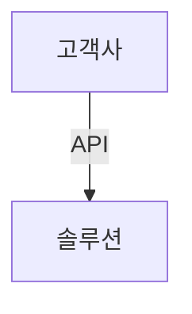

# API란?

API Application Programming Interface의 약자로, 프로그램과 프로그램 사이의 인터페이스를 의미한다. API는 프로그램이 서로 통신하기 위한 규약이다. API는 다른 프로그램이나 서비스와 상호작용하기 위한 방법을 제공한다. API는 다른 프로그램이나 서비스와 상호작용하기 위한 방법을 제공한다. API는 다른 프로그램이나 서비스와 상호작용하기 위한 방법을 제공한다. API는 다른 프로그램이나 서비스와 상호작용하기 위한 방법을 제공한다. API는 다른 프로그램이나 서비스와 상호작용하기 위한 방법을 제공한다. API는 다른 프로그램이나 서비스와 상호작용하기 위한 방법을 제공한다. API는 다른 프로그램이나 서비스와 상호작용하기 위한 방법을 제공한다. API는 다른 프로그램이나 서비스와 상호작용하기 위한 방법을 제공한다. API는 다른 프로그램이나 서비스와 상호작용하기 위한 방법을 제공한다. API는 다른 프로그램이나 서비스와 상호작용하기 위한 방법을 제공한다.

## mermaid flowchart 예제

